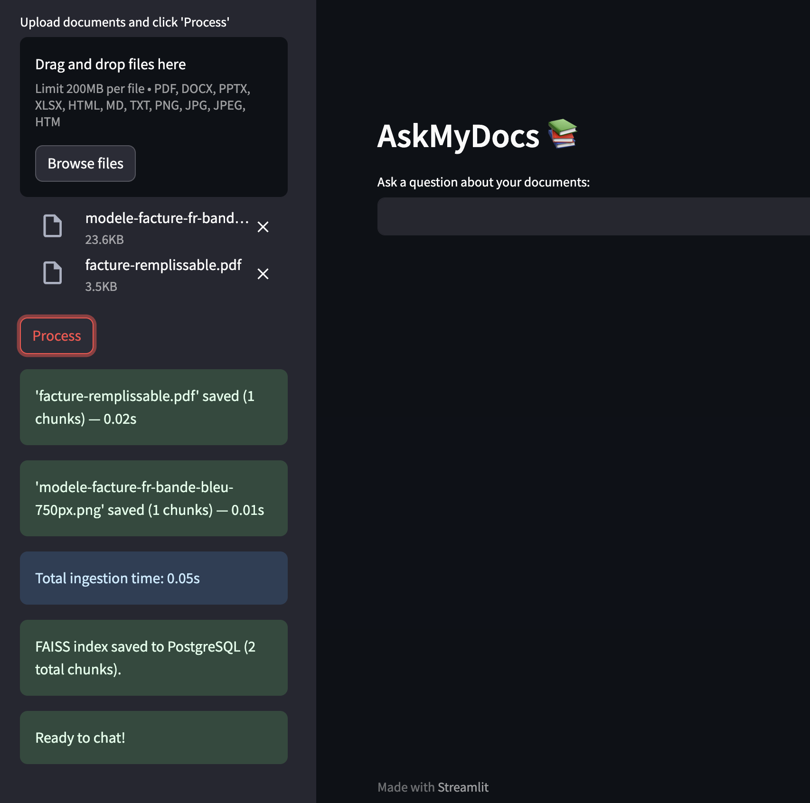
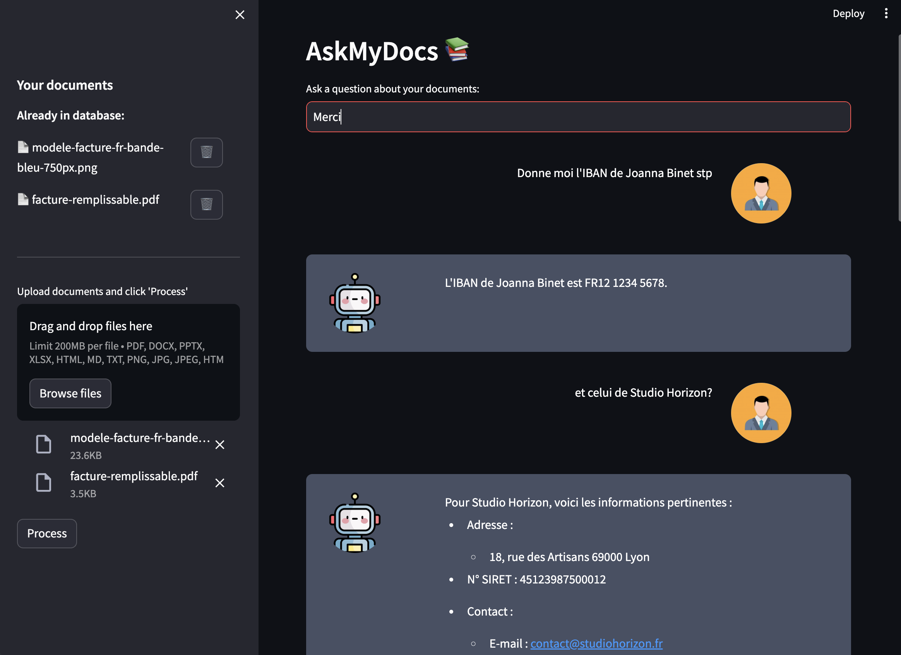

# 📄 ChatPDF — RAG local sur documents

Chatbot RAG (Retrieval-Augmented Generation) 100 % local, sans API externe.  
Posez des questions sur vos PDF, DOCX, factures, images et tableaux — tout tourne sur votre machine via Ollama.

---

## Sommaire

1. [Architecture & structure](#architecture--structure)
2. [Choix techniques](#choix-techniques)
3. [Temps de traitement](#temps-de-traitement)
4. [Installation](#installation)
5. [Lancement](#lancement)
6. [Docker](#docker)
7. [Changer de backend LLM](#changer-de-backend-llm)

---

## Architecture & structure

```
ChatPDF/
├── app.py                  # Point d'entrée Streamlit
├── pipeline.py             # Orchestration ingestion → embedding → FAISS
├── config.py               # Tous les paramètres centralisés (modèles, timeouts…)
│
├── ingestion/
│   ├── extractor.py        # Extraction Markdown via Docling
│   ├── converter.py        # Factory DocumentConverter (PDF + VLM)
│   └── chunker.py          # Découpage du texte en chunks
│
├── embeddings/
│   └── ollama.py           # Appel direct à l'API Ollama /api/embed
│
├── vectorstore/
│   └── faiss_store.py      # Création et chargement de l'index FAISS
│
├── db/
│   ├── connection.py       # Connexion PostgreSQL (psycopg2)
│   ├── documents.py        # CRUD table documents
│   ├── chunks.py           # CRUD table chunks
│   └── faiss_index.py      # Persistance de l'index FAISS en base (BYTEA)
│
├── chain/
│   └── conversation.py     # Chaîne LangChain ConversationalRetrievalChain
│
├── ui/
│   ├── sidebar.py          # Upload, boutons, statuts
│   └── chat.py             # Affichage des messages
│
└── htmlTemplates.py        # Templates HTML des bulles de chat
```

---

## Choix techniques

### Pourquoi LangChain ?

- `ConversationalRetrievalChain` gère nativement l'historique de conversation + la reformulation des questions
- Abstraction du retriever FAISS : un seul appel pour récupérer les top-K chunks
- Facile à remplacer par une autre chaîne (ReAct, RAG-Fusion…) sans toucher au reste du code

### Pourquoi FAISS ?

- Recherche vectorielle en mémoire, ultra-rapide pour des corpus de taille raisonnable (< 100k chunks)
- Index sérialisé et stocké en PostgreSQL (colonne `BYTEA`) → pas de fichier à gérer, rechargement instantané
- Pas de serveur vectoriel supplémentaire à maintenir (pas de Qdrant, Weaviate, etc.)

### Modèles utilisés

| Rôle | Modèle | Raison |
|---|---|---|
| Chat / RAG | `qwen2.5:7b` | Bon équilibre vitesse/qualité, multilingue, fonctionne bien en français |
| Embedding | `nomic-embed-text:latest` | Modèle d'embedding open-source de référence, 768 dimensions |
| Vision / OCR | `qwen3-vl:2b` | Léger, rapide, efficace sur le texte dans les images et factures |

---

## Temps de traitement

Les temps varient selon la complexité du document. Mesures indicatives sur **Mac Apple Silicon (M-series)** :

| Opération | Temps approximatif |
|---|---|
| PDF texte simple (10 pages) | 5 – 15 secondes |
| PDF avec tableaux (TableFormer) | 20 – 45 secondes |
| PDF avec images / factures (VLM) | 30 – 90 secondes selon le nombre de figures |
| Embedding d'un chunk | ~1.5 secondes (pause `EMBED_DOC_SLEEP` incluse) |
| Réponse chat (question courte) | 5 – 15 secondes |
| Réponse chat (question complexe) | 15 – 30 secondes |

> Le premier appel d'embedding est plus lent (warmup du modèle). Les suivants sont plus rapides grâce à `keep_alive: -1`.

---

## Installation

### Prérequis

- Python 3.11+
- [Ollama](https://ollama.com) installé et en cours d'exécution
- PostgreSQL en local
- (Optionnel) Docker + Docker Compose

### 1. Cloner le projet

```bash
git clone https://github.com/VOTRE_USERNAME/VOTRE_REPO.git
cd VOTRE_REPO
```

### 2. Environnement Python

```bash
python -m venv .venv
source .venv/bin/activate
pip install -r requirements.txt
```

### 3. Télécharger les modèles Ollama

```bash
ollama pull qwen2.5:7b
ollama pull nomic-embed-text:latest
ollama pull qwen3-vl:2b
```

### 4. Configurer les variables d'environnement

Créer un fichier `.env` à la racine :

```env
POSTGRES_HOST=localhost
POSTGRES_PORT=5432
POSTGRES_DB=pdf_chatbot
POSTGRES_USER=user
POSTGRES_PASSWORD=your_password
OLLAMA_URL=http://localhost:11434
```

### 5. Initialiser la base de données

Les tables sont créées **automatiquement au premier démarrage** de l'application via `db.init_db()` dans `app.py`. Aucune commande manuelle n'est nécessaire.

---

## Lancement

```bash
streamlit run app.py
```

Ouvrir [http://localhost:8501](http://localhost:8501)

---

## Docker

Docker Compose orchestre **trois services** dans un réseau interne :

| Service | Image | Rôle |
|---|---|---|
| `postgres` | `postgres:16-alpine` | Base de données persistante |
| `ollama` | `ollama/ollama:latest` | Serveur de modèles LLM & embedding |
| `app` | image buildée localement | Application Streamlit |

### 1. Lancer les services

```bash
docker compose up --build
```

### 2. Télécharger les modèles Ollama 
Une fois les conteneurs démarrés :

```bash
docker exec -it pdf_chatbot_ollama ollama pull nomic-embed-text:latest
docker exec -it pdf_chatbot_ollama ollama pull qwen2.5:7b
docker exec -it pdf_chatbot_ollama ollama pull qwen3-vl:2b
```

> Les modèles sont stockés dans le volume Docker `ollama_data` et persistent entre les redémarrages.

### 3. Accéder à l'application

Ouvrir [http://localhost:8501](http://localhost:8501)

---

## Changer de backend LLM

Tout est centralisé dans **`config.py`** et **`chain/conversation.py`**. Voici les points de modification selon le nouveau backend.

### Passer à l'API Anthropic / OpenAI

**`config.py` :**
```python
# Remplacer
CHAT_MODEL = "qwen2.5:7b"
OLLAMA_URL = "http://localhost:11434"

# Par
CHAT_MODEL = "claude-3-5-sonnet-20241022"  # ou "gpt-4o"
ANTHROPIC_API_KEY = os.getenv("ANTHROPIC_API_KEY")
```

**`chain/conversation.py` :**
```python
# Remplacer le LLM Ollama
from langchain_community.llms import Ollama
llm = Ollama(model=CHAT_MODEL, base_url=OLLAMA_URL)

# Par Anthropic
from langchain_anthropic import ChatAnthropic
llm = ChatAnthropic(model=CHAT_MODEL, api_key=ANTHROPIC_API_KEY)

# Ou OpenAI
from langchain_openai import ChatOpenAI
llm = ChatOpenAI(model="gpt-4o", api_key=os.getenv("OPENAI_API_KEY"))
```

**`embeddings/ollama.py` :**
```python
# Remplacer embed_one() par
from langchain_openai import OpenAIEmbeddings
embeddings = OpenAIEmbeddings(model="text-embedding-3-small")
```

### Passer à vLLM (serveur local OpenAI-compatible)

vLLM expose une API compatible OpenAI — le changement est minimal.

**`config.py` :**
```python
OLLAMA_URL = "http://localhost:8000"  # port vLLM par défaut
CHAT_MODEL = "mistralai/Mistral-7B-Instruct-v0.3"  # ou tout modèle HuggingFace
```

**`chain/conversation.py` :**
```python
from langchain_openai import ChatOpenAI
llm = ChatOpenAI(
    model=CHAT_MODEL,
    base_url="http://localhost:8000/v1",
    api_key="not-needed"  # vLLM n'exige pas de clé
)
```

**`embeddings/ollama.py` :**  
L'endpoint `/api/embed` est spécifique à Ollama. Avec vLLM, utiliser un modèle d'embedding séparé (ex. `nomic-embed-text` via une instance Ollama dédiée) ou `langchain_huggingface`.

### Tableau récapitulatif

| Fichier | Ollama (défaut) | OpenAI / Anthropic | vLLM |
|---|---|---|---|
| `config.py` | `OLLAMA_URL` | Clé API | URL vLLM |
| `chain/conversation.py` | `Ollama(...)` | `ChatOpenAI` / `ChatAnthropic` | `ChatOpenAI(base_url=...)` |
| `embeddings/ollama.py` | `/api/embed` direct | `OpenAIEmbeddings` | Ollama séparé ou HF |
| `ingestion/converter.py` | `/v1/chat/completions` Ollama | Inchangé si compatible | Inchangé si compatible |

---

### Captures




---
